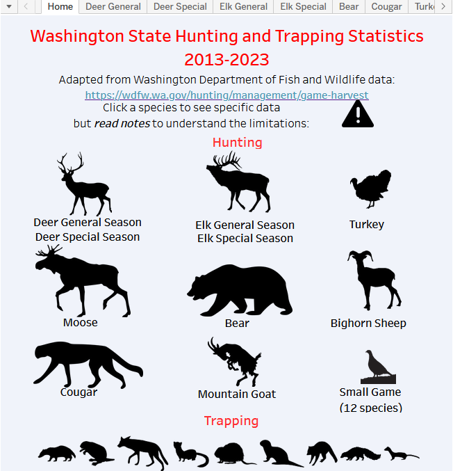

The Washington State Department of Fish and Wildlife (WDFW) maintains a website that presents data on hunting and trapping statistics by year. However, this website presents data in tables and does not allow easy comparison among years or among individual game management units.  Using the public data from the WDFW site, I assembled and maintain a Tableau Public dashboard that presents these data in a manner more easily amenable to asking and answering questions about game management statistics over time.

This repository stores the current script to retrieve the public data from the WDFW site and to export it in the correct format for importing into Tableau Public.  It also contains the shapefiles containing historical game management unit boundaries for species for which these have changed in the past, inlcuding moose, mountain goat, and bighorn sheep.

The full dashboard is available on Tableau Public at:  [https://public.tableau.com/views/WashingtonStateHuntingStatistics2013-2023/Home?:language=en-US&:sid=&:redirect=auth&:display_count=n&:origin=viz_share_link](https://public.tableau.com/views/WashingtonStateHuntingStatistics2013-2023/Home?:language=en-US&:sid=&:redirect=auth&:display_count=n&:origin=viz_share_link)

	

